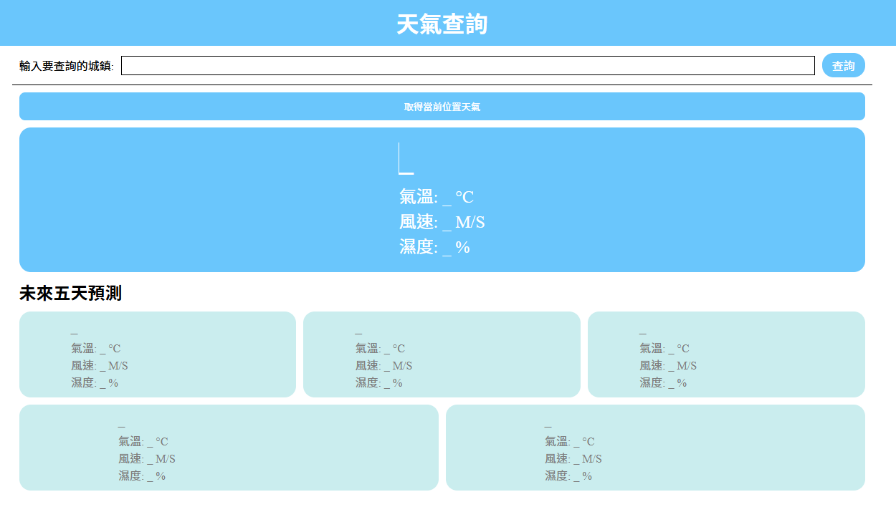

# # 天氣預報 OpenWeather ajax 串接

使用者可以直接輸入也可以從下拉選單中選取選項，以及直接獲取當前位置來得到天氣預報

---

[api 使用 OpenWeather](https://openweathermap.org/)

使用以下三隻 api:

- Direct Geocoding

  給城市名傳回經緯度

  http://api.openweathermap.org/geo/1.0/direct?q={city name},{state code},{country code}&limit={limit}&appid={API key}
- Reverse Geocoding

  給經緯度傳回城市名

  http://api.openweathermap.org/geo/1.0/reverse?lat={lat}&lon={lon}&limit={limit}&appid={API key}
- Call 5 day / 3 hour forecast data

  預測五天資料

  api.openweathermap.org/data/2.5/forecast?lat={lat}&lon={lon}&appid={API key}
